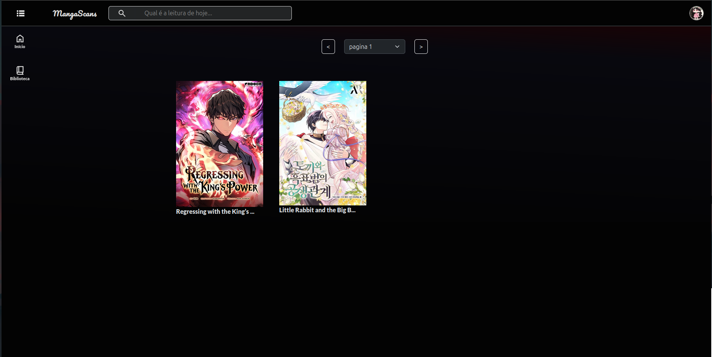

# MangaScans

Bem-vindo ao **MangaScans**! 🌟

O **MangaScans** é uma aplicação web feita para os verdadeiros amantes de mangás. Nossa plataforma torna a leitura dos seus títulos favoritos mais acessível e transforma a descoberta de novas histórias em uma verdadeira aventura. Com um design moderno e uma interface intuitiva, você se sentirá em casa navegando por um vasto mundo de narrativas incríveis!



## 🛠️ Tecnologias Utilizadas

Aqui estão as principais ferramentas e tecnologias que sustentam o MangaScans:

- **Frontend**: **Angular** – para uma interface rica e responsiva, proporcionando uma experiência de usuário fluida.
- **Backend**: **ASP.NET Core API** – um sistema poderoso e eficiente, garantindo que sua leitura nunca seja interrompida.
- **Banco de Dados**: **Entity Framework Core** com **MySQL** – para uma persistência de dados robusta e confiável.
- **Autenticação Segura**: **Identity** com **JWT Bearer** – para proteger suas informações e garantir uma experiência segura.
- **Documentação**: **Swagger** – permitindo que você compreenda e interaja com a API de forma intuitiva.
- **Modelo com Controladores**: Uma estrutura limpa e organizada para gerenciar a lógica do aplicativo e suas interações.

## 🚀 Instalação

Pronto para começar? Siga os passos simples abaixo:

1. **Clone o repositório**:
   ```bash
   git clone https://github.com/JaymeFernandes/MangaScans
   cd MangaScans
   ```

2. **Configuração de Variáveis de Ambiente**

   Antes de iniciar o backend, é fundamental configurar as variáveis de ambiente para armazenar informações sensíveis, como strings de conexão com o banco de dados, senhas e chaves de segurança. 

   ### No Windows (CMD):
   ```bash
   set ConnectionStrings__MySQLConnection="Server=localhost;Database=Manga;Uid=root;Pwd=YourPassword;"
   set ConnectionStrings__IdentityConnection="Server=localhost;Database=MangaIdentity;Uid=root;Pwd=YourPassword;"
   set JWTConfig__SecurityKey="Your-Password-Token"
   set UserAdmin__Password="Admin@123456"
   set Admin_Email="Admin_Email"
   set Admin_Password="Admin_Password"
   ```

   ### No Linux/MacOS (Bash):
   ```bash
   export ConnectionStrings__MySQLConnection="Server=localhost;Database=Manga;Uid=root;Pwd=YourPassword;"
   export ConnectionStrings__IdentityConnection="Server=localhost;Database=MangaIdentity;Uid=root;Pwd=YourPassword;"
   export JWTConfig__SecurityKey="Your-Password-Token"
   export UserAdmin__Password="Admin@123456"
   export Admin_Email="Admin_Email"
   export Admin_Password="Admin_Password"
   ```

   ### Criação do arquivo `.env` (opcional para desenvolvimento):
   
   **No Windows (CMD):**
   ```bash
   cd src/MangaScans.Api/
   type nul > .env
   ```

   **No Linux (Bash):**
   ```bash
   cd src/MangaScans.Api/
   touch .env
   ```

   **Conteúdo do arquivo `.env`:**
   ```env
   MySQLConnection="Server=localhost;Database=Manga;Uid=root;Pwd=YourPassword;"
   IdentityConnection="Server=localhost;Database=MangaIdentity;Uid=root;Pwd=YourPassword;"
   TokenSecurityKey="Your-Password-Token"
   Admin_Email="Admin_Email"
   Admin_Password="Admin_Password"
   ```

3. **Navegue até a pasta do backend e execute**:
   ```bash
   cd src/MangaScans.Api
   dotnet restore
   dotnet run
   ```

4. **Navegue até a pasta do frontend e execute**:
   ```bash
   cd src/MangaScans.Client
   npm install
   ng serve
   ```

## 🤝 Contribuição

Adoramos a participação da comunidade! Se você tem ideias ou melhorias, siga estas etapas:

1. **Faça um fork do repositório.**
2. **Crie uma nova branch**:
   ```bash
   git checkout -b feature/nome-da-sua-feature
   ```
3. **Realize suas alterações e faça commit**:
   ```bash
   git commit -m 'Adiciona nova funcionalidade'
   ```
4. **Envie para o repositório remoto**:
   ```bash
   git push origin feature/nome-da-sua-feature
   ```
5. **Abra um Pull Request**.

## 📜 Licença

Esse projeto está licenciado sob a [MIT License](LICENSE).

## 📬 Contato

Tem perguntas ou feedback? Estou aqui para ajudar! Entre em contato pelo e-mail: jaymegodoi27@gmail.com